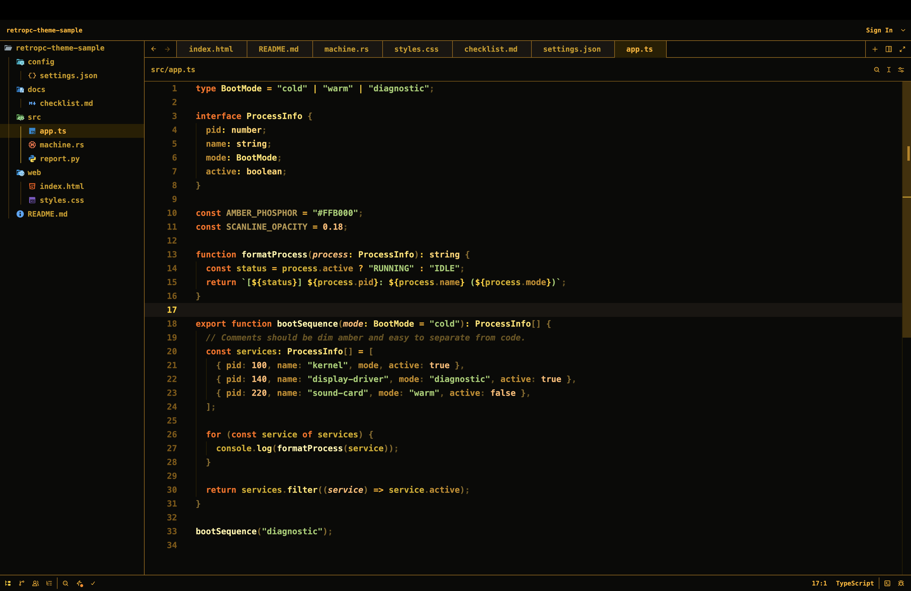

# RetroPC for Zed

Amber CRT theme for Zed, inspired by the Omarchy RetroPC theme.



## Install

From Zed:

1. Open the command palette.
2. Run `zed: install dev extension`.
3. Select this repository folder.
4. Run `theme selector: toggle`.
5. Choose `RetroPC`.

## Matching Font

Zed themes cannot set editor fonts or background images directly. To match the
upstream theme more closely, install `Bm437 IBM XGA-AI 12x23` and add settings
like:

```json
{
  "buffer_font_family": "Bm437 IBM XGA-AI 12x23",
  "terminal": {
    "font_family": "Bm437 IBM XGA-AI 12x23",
    "minimum_contrast": 0
  }
}
```

## Source

Palette and terminal colors are ported from
[rondilley/omarchy-retropc-theme](https://github.com/rondilley/omarchy-retropc-theme).

## License

GPL-3.0, matching the upstream source theme.
